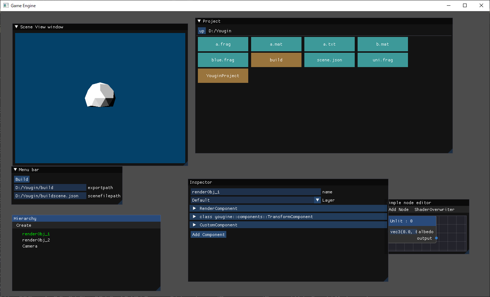

# Yougine 

これは、OpenGL + imguiで開発中のゲームエンジンのリポジトリです

> 開発中の段階の為、まだ配布する段階にありません。配布する際にはRelease等で配布を検討しております。

# 特徴
- Windowsで動くゲームエンジン
- ゲームオブジェクト＆コンポーネントシステム採用

# 実装済み機能
## 基本機能
|                    |                                                                                                                                                                                    | 
| ------------------ | ---------------------------------------------------------------------------------------------------------------------------------------------------------------------------------- | 
| シーン             | ゲームの世界。後述するゲームオブジェクトの一覧を持つ。                                                                                                                             | 
| ゲームオブジェクト | ゲームの世界に存在するオブジェクト一つ一つ。(ex : キャラクターや建物、木等がそれぞれゲームオブジェクト)                                                                            | 
| コンポーネント     | ゲームオブジェクトの挙動を決めるもの。ゲームオブジェクトに複数付けられる。（ex: どの様に描画するか決定するレンダーコンポネント、物理的挙動をさせるリギッドボディーコンポーネント） | 

## エディター

基本的なエディタウィンドーは以下。

| エディタウィンドー | 説明                                                             | 
| ------------------ | ---------------------------------------------------------------- | 
| SceneWindow        | シーンを描画する                                                 | 
| HierarchyWindow    | シーンにあるゲームオブジェクト一覧を表示する                     | 
| InspectorWindow    | 選択したゲームオブジェクト、又はリソースの詳細を表示、編集できる | 
| ProjectWindow      | リソースを管理する                                               | 

他にもゲームをビルドするボタンなどを格納するMenubarウィンドー（将来バーになる）や、シェーダをノードプログラミングで開発できるウィンドー等も開発中です。

## 実装途中の機能
- 立方体や球などの当たり判定用のColliderComponent
- シェーダをノードプログラミングで開発する機能。
- ユーザがc++で独自コンポーネントを定義できるCustomComponent

# third party library

glew
glfw
glm
gsl
imgui
imnodes
stduuid
tinygltf
